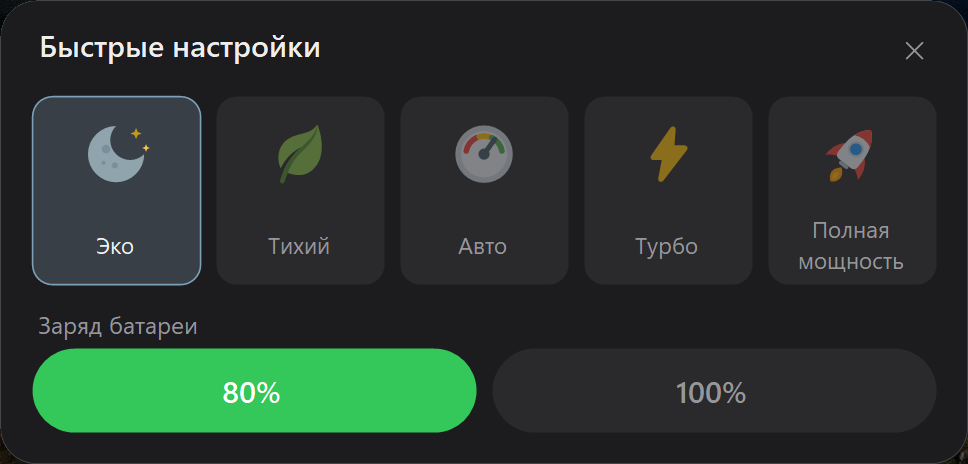

# Xi Control


[](https://buymeacoffee.com/3CLiAI1)

Лёгкая утилита в трее для ноутбуков **Xiaomi / Redmi (Redmibook)**: защита заряда батареи,
режимы производительности, OSD и «оживление» фирменных клавиш.

Всё управление идёт **через штатный WMI-интерфейс прошивки** (`MiCommonInterface`, ODM Bitland «MIFS») —
тот же канал, которым пользуется официальный Xiaomi PC Manager.
**Никакого WinRing0**, никаких сторонних драйверов и прямого доступа к EC.

<p align="center">
  
</p>

*Панель быстрых настроек (удержание кнопки Mi): пять режимов производительности
и лимит заряда. Значок в трее меняется по активному режиму:*

<p align="center">
  
</p>

## Возможности

- 🔋 **Защита заряда** — «беречь батарею» (зарядка до ~80%) / полный заряд 100%.
  - **ChargeGuard**: прошивка сбрасывает лимит после сна и переключения питания —
    утилита автоматически переустанавливает его.
- ⚡ **Режимы производительности**: Эко (скрытый режим прошивки) / Тихий / Авто /
  Турбо / Полная мощность. Эко и Полную мощность можно убрать из UI через конфиг.
- 🖥️ **OSD-оверлей** (тёмная карточка, авторские иконки):
  - подключение/отключение зарядки («Зарядка до 80%» / «Работа от батареи» + уровень);
  - смена режима производительности и лимита заряда;
  - микрофон вкл/выкл, подсветка клавиатуры (выкл / 50% / 100% / авто).
- 🅼 **Mi-кнопка**:
  - короткое нажатие — циклическое переключение режимов с OSD;
  - удержание — панель быстрых настроек (режимы + заряд 80/100, закрытие по Esc/X/клику вне).
- ⌨️ **Оживление «мёртвых» клавиш**: проекция → Win+P, «настройки» → переключение
  лимита заряда 80/100 с OSD, AI-клавиша → Copilot (Win+C) или своя программа,
  клавиша микрофона мьютит системный микрофон.
- 🎨 Значок в трее меняется по режиму, монохром под светлую/тёмную панель задач;
  тёмное меню в тон системной теме (переключается на лету).
- 🌐 Язык интерфейса: русский / английский / китайский (中文).
- 🚀 Автозапуск через Планировщик заданий (без UAC-запроса при входе, работает на батарее).

## Совместимость

Проверено на **Xiaomi Book Pro 14** (TM2424). Должно работать на ноутбуках Xiaomi/Redmi
производства ODM Bitland с WMI-классом `MiCommonInterface` (большинство Redmibook / Xiaomi Book
последних поколений).

Проверить свою машину (PowerShell):

```powershell
Get-CimClass -Namespace root/wmi -ClassName MiCommonInterface
```

Если класс нашёлся — интерфейс есть. Набор поддерживаемых функций зависит от модели
(утилита определяет их в рантайме и не падает на неподдерживаемых).

## Установка

Готовый exe — на [странице релизов](../../releases):

- `XiControl-vX.X.X-win-x64.exe` — самодостаточный, ничего ставить не нужно (~70 МБ);
- `XiControl-vX.X.X-win-x64-net8.exe` — лёгкий (~2 МБ), требует
  [.NET 8 Desktop Runtime](https://dotnet.microsoft.com/download/dotnet/8.0).

Запуск — от администратора (это требование WMI-интерфейса прошивки — даже чтение
без elevation не работает).

Сборка из исходников:

```powershell
dotnet build src/XiControl.csproj -c Release
# → src/bin/Release/net8.0-windows/XiControl.exe
```

Один переносимый .exe (без установленного .NET):

```powershell
dotnet publish src/XiControl.csproj -c Release -r win-x64 --self-contained -p:PublishSingleFile=true
```

## Использование

Запусти `XiControl.exe` (подтверди UAC) — появится значок в трее.

| Действие | Результат |
|----------|-----------|
| Клик по значку (любой кнопкой) | Меню: заряд, режим, язык, автозапуск, выход |
| Mi-кнопка, одинарный клик | Следующий режим производительности + OSD |
| Mi-кнопка, двойной клик | Переключение лимита заряда 80% ↔ 100% + OSD |
| Mi-кнопка, удержание ~0.5 с | Панель быстрых настроек |
| Клавиша микрофона | Мьют/анмьют системного микрофона + OSD |
| Клавиша «настройки» | Переключение лимита заряда 80% ↔ 100% + OSD |
| Клавиша подсветки клавиатуры | OSD с уровнем (выкл / 50% / 100% / авто) |

Для автозапуска включи «Запускать с Windows» в меню — задача планировщика создаётся
с повышенными правами, поэтому при входе UAC-запрос не показывается.

### Скрыть ненужные режимы

Проще всего — галочки в меню трея: **Настройки → Показывать «Эко» / «Полную
мощность»** (применяется сразу). То же самое в `%APPDATA%\XiControl\config.json`
(скрытый режим включить из приложения станет нельзя):

```json
"EcoMode": false,
"FullSpeedMode": false
```

- **Эко** — скрытый режим прошивки, которого нет в официальном софте (на проверенной
  модели гасит подсветку клавиатуры и снижает яркость экрана — самый экономный профиль);
- **Полная мощность** — если не пользуешься или хочешь исключить случайное включение
  (режим шумный и требует питания от DC-разъёма).

По умолчанию оба показываются. После правки перезапусти приложение.

### Переназначение клавиш

Раскладка клавиш переключается в меню: **Настройки → «Клик Mi — производительность» /
«Двойной клик Mi» / «Клавиша настроек — заряд»**. То же самое — в `config.json`:

```json
"SettingsKey": "settings",
"MiShortPress": "charge"
```

- `SettingsKey` — клавиша «настройки»: `"charge"` (по умолчанию) — переключение
  заряда 80/100, `"settings"` — открыть Параметры Windows;
- `MiShortPress` — раскладка кликов Mi-кнопки: `"modes"` (по умолчанию) —
  одинарный клик переключает режимы по кругу, двойной — заряд 80/100;
  `"charge"` — наоборот (одинарный — заряд, двойной — режимы).
  Удержание Mi всегда открывает панель.
- `MiDoubleClick` — `false` отключает жест двойного клика: одинарный клик
  срабатывает мгновенно, без окна ожидания ~300 мс (по умолчанию `true`).

### Настройка AI-клавиши

По умолчанию AI-клавиша открывает Copilot (Win+C). Можно назначить свою программу —
в `%APPDATA%\XiControl\config.json` добавь:

```json
"AiKeyProgram": "C:\\Tools\\MyApp.exe",
"AiKeyArgs": "--flag"
```

Подойдёт exe, документ или URL (например `"https://chat.example.com"`); переменные
окружения (`%USERPROFILE%` и т.п.) раскрываются. `AiKeyArgs` — опционально.
После правки конфига перезапусти приложение. Учти: XiControl работает с правами
администратора, поэтому запущенная программа тоже их унаследует.

## Ограничения

- Порог «беречь батарею» зашит в прошивку — произвольный процент через WMI невозможен.
  На проверенной модели (TM2424) это ≈80%; на других моделях порог может отличаться
  (например, 70% на моделях, которые обслуживал MI Control).
- Комбинация Fn+Mi не отличима от одиночной Mi (прошивка шлёт одинаковые события),
  поэтому используется короткое/длинное нажатие.
- Набор функций зависит от модели: телеметрия (обороты вентиляторов, температуры)
  на проверенной машине прошивкой не поддерживается.

## Как это работает

Протокол MIFS разобран и задокументирован в [docs/](docs/):

- [01-wmi-protocol.md](docs/01-wmi-protocol.md) — транспорт, формат буфера, коды команд, события клавиш (**главный документ**);
- [02-feature-catalog.md](docs/02-feature-catalog.md) — каталог функций;
- [03-architecture.md](docs/03-architecture.md) — архитектура приложения;
- [07-keymap.md](docs/07-keymap.md) — карта кодов клавиш.

Коротко: метод `MiInterface` принимает 32-байтовый буфер
(`[1]` — GET `0xFA` / SET `0xFB`, `[3]` — команда, `[4]/[6]` — аргументы) и возвращает
статус в `OUT[1]` (`0x80` — ок). Заряд — команда `0x10`, режимы — `0x08`,
события клавиш приходят WMI-событием `HID_EVENT20`.

Протокол восстановлен по открытым источникам (включая драйвер ядра Linux) **без копирования чужого кода** —
переносились только факты об интерфейсе. Подробности и лицензии источников: [docs/04-references.md](docs/04-references.md).

## Разработка

```
src/            приложение (C# / .NET 8 / WinForms)
assets/svg/     иконки: osd/ — цветные 128×128, tray/ — монохром 24×24 (currentColor)
tools/IconPreview/  рендер иконок в PNG для проверки + генерация app.ico
docs/           документация протокола и архитектуры
reference/      PowerShell-пробы, журналы исследования прошивки
```

Диагностика: ошибки пишутся в `%APPDATA%\XiControl\log.txt`.

История изменений: [CHANGELOG.md](CHANGELOG.md) · Планы: [ROADMAP.md](ROADMAP.md)

## Лицензия

[GPL-3.0](LICENSE).

Утилита пригодилась? Можно [угостить кофе ☕](https://buymeacoffee.com/3CLiAI1).

---

## English

**Xi Control** — a lightweight tray utility for Xiaomi / Redmi (Redmibook) laptops:
battery charge limit (~80% / 100%) with automatic re-arm after sleep, performance modes
(Quiet / Auto / Turbo / Full speed), OSD overlays, Mi button handling (short press —
cycle modes, hold — quick settings panel) and fixes for otherwise dead special keys.

Everything is driven through the firmware's stock WMI interface (`MiCommonInterface`,
Bitland "MIFS") — **no WinRing0, no third-party drivers**. Requires Windows 10/11 x64
and administrator rights (a firmware WMI requirement). UI is available in English.

Check compatibility: `Get-CimClass -Namespace root/wmi -ClassName MiCommonInterface`.
Build: `dotnet build src/XiControl.csproj -c Release`. License: GPL-3.0.
