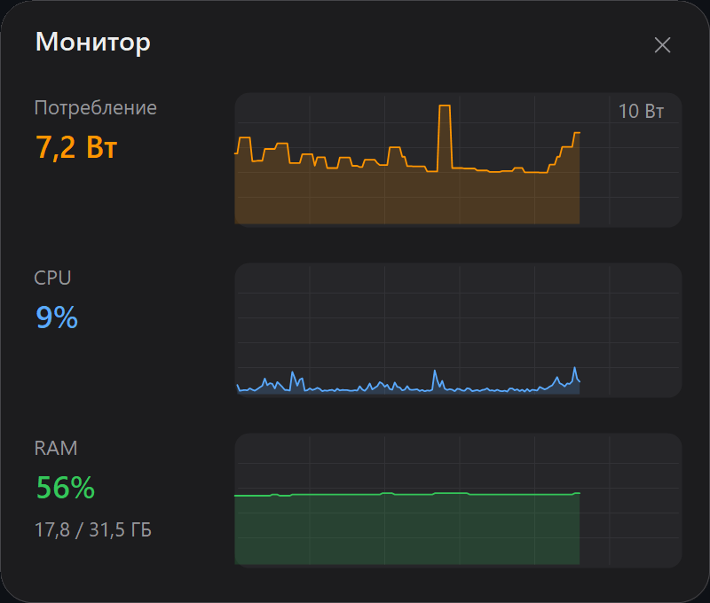

# Xi Control


[](https://buymeacoffee.com/3CLiAI1)

Лёгкая утилита в трее для ноутбуков **Xiaomi / Redmi (Redmibook)** — в первую очередь
для **Xiaomi Book Pro 14 (2026)**, на котором она разработана и обкатана, но не только
для него. Защита заряда батареи, режимы производительности, OSD и «оживление»
фирменных клавиш.

Всё управление идёт **через штатный WMI-интерфейс прошивки** (`MiCommonInterface`, ODM Bitland «MIFS») —
тот же канал, которым пользуется официальный Xiaomi PC Manager.
**Никакого WinRing0**, никаких сторонних драйверов и прямого доступа к EC.

<p align="center">
  
</p>

*Панель быстрых настроек (удержание кнопки Mi): пять режимов производительности,
лимит заряда, «В дорогу» (разовый заряд до 100%), авто-герцовка и «режим совы» (не спать).*

<p align="center">
  
</p>

*Окно «Монитор»: живые графики потребления (Вт), загрузки CPU и RAM.*

<p align="center">
  
  &nbsp;&nbsp;
  
</p>

*Виджет сворачивается в компактную строку (Power / CPU / RAM) или в один показатель ватт —
кнопкой «вид» или двойным кликом; направление тока — цветом (заряд зелёный / разряд оранжевый).*

*Значок в трее меняется по активному режиму:*

<p align="center">
  
</p>

## Возможности

- 🔋 **Защита заряда** — «беречь батарею» (зарядка до ~80%) / полный заряд 100%.
  - **ChargeGuard**: прошивка сбрасывает лимит после сна и переключения питания —
    утилита автоматически переустанавливает его.
  - 🧳 **Режим «В дорогу»** — разово зарядить до 100% поверх «беречь 80%»: кнопка-чемоданчик
    в панели / пункт меню. По достижении 100% — OSD и звуковой сигнал; при отключении зарядника
    режим сам сбрасывается (следующее подключение снова 80%).
- ⚡ **Режимы производительности**: Эко (скрытый режим прошивки) / Тихий / Авто /
  Турбо / Полная мощность. Эко и Полную мощность можно убрать из UI через конфиг.
- 🖥️ **OSD-оверлей** (тёмная карточка, авторские иконки):
  - подключение/отключение зарядки («Зарядка до 80%» / «Работа от батареи» + уровень);
  - смена режима производительности и лимита заряда;
  - микрофон вкл/выкл, подсветка клавиатуры (выкл / 50% / 100% / авто).
- 🅼 **Mi-кнопка**:
  - короткое нажатие — циклическое переключение режимов с OSD;
  - удержание — панель быстрых настроек (режимы + заряд 80/100, закрытие по Esc/X/клику вне).
- ⌨️ **Оживление «мёртвых» клавиш**: проекция → Win+P, «настройки» → переключение
  лимита заряда 80/100 с OSD, AI-клавиша → Copilot (Win+C) или своя программа,
  клавиша микрофона мьютит системный микрофон.
- 🎨 Значок в трее меняется по режиму, монохром под светлую/тёмную панель задач;
  тёмное меню в тон системной теме (переключается на лету).
- 🦉 **«Режим совы»** — не гасить экран и не засыпать; закрытая крышка на питании
  от сети лишь выключает экран (на батарее — штатный сон). Сова в панели / галочка
  в меню; тайминги электропитания не изменяются, действие крышки восстанавливается.
  Можно скрыть фичу целиком (`"OwlMode": false` в конфиге).
- 🖥️ **Авто-герцовка** — подключил зарядку → экран 120 Гц, отключил → 60 Гц
  (частоты настраиваются в конфиге: `AcRefreshRate`/`BatteryRefreshRate`; если такой
  частоты у панели нет — берётся ближайшая). Переключатель в меню и ячейка в панели;
  держится после сна и смены питания.
- 🔌 **Профили питания** — свой режим производительности при зарядке и от батареи
  (выбор в меню, «Не менять»); опционально — память яркости экрана на каждое состояние.
  Применяется на старте и при смене питания; driver-free (режим — WMI прошивки, яркость — WMI ACPI).
- 🌐 Язык интерфейса: русский / английский / китайский (中文).
- 🚀 Автозапуск через Планировщик заданий (без UAC-запроса при входе, работает на батарее).

## Совместимость

Проверено на **Xiaomi Book Pro 14** (TM2424). Должно работать на ноутбуках Xiaomi/Redmi
производства ODM Bitland с WMI-классом `MiCommonInterface` (большинство Redmibook / Xiaomi Book
последних поколений).

Проверить свою машину (PowerShell):

```powershell
Get-CimClass -Namespace root/wmi -ClassName MiCommonInterface
```

Если класс нашёлся — интерфейс есть. Набор поддерживаемых функций зависит от модели
(утилита определяет их в рантайме и не падает на неподдерживаемых).

## Установка

Готовый exe — на [странице релизов](../../releases):

- `XiControl-vX.X.X-win-x64.exe` — самодостаточный, ничего ставить не нужно (~70 МБ);
- `XiControl-vX.X.X-win-x64-net8.exe` — лёгкий (~2 МБ), требует
  [.NET 8 Desktop Runtime](https://dotnet.microsoft.com/download/dotnet/8.0).

Запуск — от администратора (это требование WMI-интерфейса прошивки — даже чтение
без elevation не работает).

Сборка из исходников:

```powershell
dotnet build src/XiControl.csproj -c Release
# → src/bin/Release/net8.0-windows/XiControl.exe
```

Один переносимый .exe (без установленного .NET):

```powershell
dotnet publish src/XiControl.csproj -c Release -r win-x64 --self-contained -p:PublishSingleFile=true
```

## Использование

Запусти `XiControl.exe` (подтверди UAC) — появится значок в трее.

| Действие | Результат |
|----------|-----------|
| Клик по значку (любой кнопкой) | Меню: заряд, режим, язык, автозапуск, выход |
| Mi-кнопка, одинарный клик | Следующий режим производительности + OSD |
| Mi-кнопка, двойной клик | Переключение лимита заряда 80% ↔ 100% + OSD |
| Mi-кнопка, удержание ~0.5 с | Панель быстрых настроек |
| Клавиша микрофона | Мьют/анмьют системного микрофона + OSD |
| Клавиша «настройки» | Переключение лимита заряда 80% ↔ 100% + OSD |
| Клавиша подсветки клавиатуры | OSD с уровнем (выкл / 50% / 100% / авто) |

Для автозапуска включи «Запускать с Windows» в меню — задача планировщика создаётся
с повышенными правами, поэтому при входе UAC-запрос не показывается.

### Режим «В дорогу» (разовый заряд до 100%)

Обычно держишь «беречь 80%», но перед поездкой хочется полный заряд. Нажми
**кнопку-чемоданчик** в панели (слева от пилюль 80/100) или пункт **«Зарядить „в дорогу"»**
в меню — утилита разово снимет ограничение и дозарядит до 100%.

- По достижении **100%** — OSD «можно в дорогу» и звуковой сигнал (переключатель
  **Настройки → «Звук готовности „в дорогу"»**, по умолчанию вкл).
- **Отключил зарядник → режим сам выключается**; следующее подключение снова бережёт 80%.
- Ручной выбор пилюли 80/100 тоже отменяет режим. При постоянном «100%» кнопка неактивна
  (дозаряжать некуда).

Пилюли 80/100 показывают **базовую** настройку — «В дорогу» это временный оверрайд поверх неё
(driver-free, тот же WMI-канал заряда). В `config.json`: `"TravelMode"`, `"TravelSound"`.

Свой звук готовности — путь к WAV в `config.json` (пусто или файл не найден → встроенный джингл;
поддерживаются `%ПЕРЕМЕННЫЕ%`; только WAV/PCM):

```json
"TravelSoundFile": "C:\\Users\\Me\\Sounds\\ready.wav"
```

### Скрыть ненужные режимы

Проще всего — галочки в меню трея: **Настройки → Показывать «Эко» / «Полную
мощность»** (применяется сразу). То же самое в `%APPDATA%\XiControl\config.json`
(скрытый режим включить из приложения станет нельзя):

```json
"EcoMode": false,
"FullSpeedMode": false
```

- **Эко** — скрытый режим прошивки, которого нет в официальном софте (на проверенной
  модели гасит подсветку клавиатуры и снижает яркость экрана — самый экономный профиль);
- **Полная мощность** — если не пользуешься или хочешь исключить случайное включение
  (режим шумный и работает только от сети).

По умолчанию оба показываются. После правки перезапусти приложение.

### Режим производительности при старте

Прошивка сбрасывает режим при перезагрузке. Что включать на старте — в меню
**Настройки → «Режим при старте»** (три взаимоисключающих режима; третий, «Профили питания», — ниже):

- **Восстанавливать последний** — приложение запоминает выбранный режим и возвращает его после
  перезагрузки (следует за твоими переключениями). При включении сразу запоминает текущий.
- **Закрепить текущий режим** — фиксирует **один** режим: он будет включаться каждый старт,
  с какого бы ни выключились. Кликаешь, находясь в нужном режиме, — он закрепляется; клик ещё
  раз снимает закрепление.

Если нужный режим на старте недоступен (например, «Полная мощность» на батарее) — включится «Авто».

Закреплённый режим можно задать и правкой `config.json`: `"ForceStartMode": "Eco"` (допустимо
`"Quiet"` / `"Turbo"` / `"FullSpeed"` / `"Auto"` / `"Eco"`; `null` или удалить строку — снять).

### Профили питания (режим и яркость по питанию)

Третий режим «Режима при старте»: **свой режим производительности при зарядке и от батареи** — и,
опционально, память яркости экрана для каждого состояния. Включается в меню
**Настройки → Режим при старте → «Профили питания»** (взаимоисключающе с «Восстанавливать» /
«Закрепить»). Когда включено, там же появляются:

- **При зарядке →** режим (Эко / Тихий / Авто / Турбо / Полная мощность) или «Не менять»;
- **От батареи →** то же;
- **Запоминать яркость** — вкл/выкл (по умолчанию **выкл**).

```json
"PowerProfiles": true,
"AcPerfMode": "Turbo",       // режим от сети; null или "Не менять" — не трогать
"BatteryPerfMode": "Quiet",  // режим от батареи
"RememberBrightness": false
```

Поведение (всё driver-free: режим — WMI прошивки `0x08`, яркость — WMI `WmiMonitorBrightness*`,
ACPI-подсветка, тот же канал, что у Windows):

- **Профиль применяется на старте и при каждой смене питания** сеть↔батарея (и после сна),
  через гард с дебаунсом — как у защиты заряда и авто-герцовки.
- **Режим:** ставится `AcPerfMode`/`BatteryPerfMode` для текущего питания; «Не менять» — режим не
  трогается. Если прошивка не приняла (например, «Полная мощность» на батарее) — мягкий откат на «Авто».
- **Яркость запоминается только при включённой опции** (по умолчанию нет). Тогда утилита следит за
  твоей яркостью в каждом состоянии и восстанавливает её при следующем переходе: выставил 80 % на
  зарядке → при следующем подключении вернётся 80 %. Это значит, что XiControl **перебивает яркость
  Windows** своим значением — поэтому и включается явно; на переходе возможна кратковременная двойная
  подстройка (Windows → через ~1.5 с наше). `AcBrightness`/`BatteryBrightness` в конфиге заполняются сами.
- Смена режима и яркости — **в фоне** (UI не блокируется); на панели без WMI-яркости фича молча
  деградирует (пишет в `log.txt`, не падает). Запись конфига дебаунсится (бережём SSD).

После правки чисел в `config.json` перезапусти приложение.

### Авто-герцовка (частота экрана по питанию)

Экран переключается на разную частоту в зависимости от источника питания: от сети — повыше
(плавность), от батареи — пониже (экономия). Включается галочкой в меню (**Настройки → «Авто-герцовка»**)
или ячейкой в панели быстрых настроек. Частоты правятся только в `config.json`:

```json
"AutoRefreshRate": true,
"AcRefreshRate": 120,
"BatteryRefreshRate": 60
```

Как это ведёт себя на самом деле (чистый Win32 `ChangeDisplaySettings`, драйвер не нужен):

- **Только основной экран**, разрешение и глубина цвета не трогаются — меняется лишь частота.
- **Берётся ближайшая поддерживаемая частота** при текущем разрешении: попросили 120, а панель
  умеет только 90/60 → выберет 90 (при равном расстоянии — большую). Поэтому вписать «144» на
  60-герцовой матрице безопасно — просто останется 60. Значение ≤ 0 в конфиге игнорируется.
- **Срабатывает** на старте приложения, при смене питания сеть↔батарея и при выходе из сна
  (эти два — через дебаунс ~1.5 с, события приходят пачкой), а также сразу при включении опции.
- Если нужная частота **уже стоит — экран не мигает** (лишний вызов не делается).
- Частота пишется в реестр дисплея (`CDS_UPDATEREGISTRY`), т.е. **переживает перезагрузку**;
  но при выключенной опции приложение частоту **не трогает вообще** (в т.ч. в момент снятия галки —
  что стояло, то и останется, вернуть вручную).
- Сама смена видеорежима идёт **в фоновом потоке** (не блокирует UI), а неудача просто пишется
  в `log.txt`, приложение не падает. OSD смены питания дописывает фактическую частоту («… • 120 Гц»).

Числа `AcRefreshRate`/`BatteryRefreshRate` читаются при старте — после правки конфига перезапусти приложение.

### Переназначение клавиш

Каждой клавише — своё действие: **Настройки → Клавиши**. Слоты — одиночный и двойной
клик Mi-кнопки, клавиши «Настройки» (шестерёнка), AI и «Проекция». На любой слот можно
навесить: цикл режимов, заряд 80/100, быструю панель, режим совы, «Монитор»,
«В дорогу», системные «Проекция (Win+P)» / «Параметры Windows» / «Copilot (Win+C)»,
запуск своей программы или «Ничего».

- Удержание Mi-кнопки всегда открывает быструю панель (не настраивается).
- Двойной клик Mi = «Ничего» → жест отключён, одиночный клик срабатывает мгновенно
  (без окна ожидания ~300 мс).
- При открытой панели клавиша «Настройки» всегда переключает заряд (пилюля в панели).
- Для «Запустить программу…» подойдёт exe, документ или URL; переменные окружения
  (`%USERPROFILE%` и т.п.) раскрываются, путь с пробелами — в кавычках, после пути
  можно дописать аргументы: `"C:\\Program Files\\App\\app.exe" --flag`. Учти:
  XiControl работает с правами администратора — запущенная программа их унаследует.

В `config.json` это пары `*Action`/`*Command` (`MiClick`, `MiDouble`, `SettingsKey`,
`AiKey`, `ProjKey`), значения действий: `modes`, `charge`, `panel`, `owl`, `monitor`,
`travel`, `projection`, `settings`, `copilot`, `launch`, `none`:

```json
"MiClickAction": "modes",
"MiDoubleAction": "charge",
"AiKeyAction": "launch",
"AiKeyCommand": "\"C:\\Program Files\\App\\app.exe\" --flag"
```

Старые опции (`MiShortPress`, `MiDoubleClick`, `SettingsKey`, `AiKeyProgram`/`AiKeyArgs`)
переносятся автоматически при первом запуске новой версии.

## Ограничения

- Порог «беречь батарею» зашит в прошивку — произвольный процент через WMI невозможен.
  На проверенной модели (TM2424) это ≈80%; на других моделях порог может отличаться
  (например, 70% на моделях, которые обслуживал MI Control).
- Комбинация Fn+Mi не отличима от одиночной Mi (прошивка шлёт одинаковые события),
  поэтому используется короткое/длинное нажатие.
- Набор функций зависит от модели: телеметрия (обороты вентиляторов, температуры)
  на проверенной машине прошивкой не поддерживается.

## Как это работает

Протокол MIFS разобран и задокументирован в [docs/](docs/):

- [01-wmi-protocol.md](docs/01-wmi-protocol.md) — транспорт, формат буфера, коды команд, события клавиш (**главный документ**);
- [02-feature-catalog.md](docs/02-feature-catalog.md) — каталог функций;
- [03-architecture.md](docs/03-architecture.md) — архитектура приложения;
- [07-keymap.md](docs/07-keymap.md) — карта кодов клавиш.

Коротко: метод `MiInterface` принимает 32-байтовый буфер
(`[1]` — GET `0xFA` / SET `0xFB`, `[3]` — команда, `[4]/[6]` — аргументы) и возвращает
статус в `OUT[1]` (`0x80` — ок). Заряд — команда `0x10`, режимы — `0x08`,
события клавиш приходят WMI-событием `HID_EVENT20`.

Протокол восстановлен по открытым источникам (включая драйвер ядра Linux) **без копирования чужого кода** —
переносились только факты об интерфейсе. Подробности и лицензии источников: [docs/04-references.md](docs/04-references.md).

## Разработка

```
src/            приложение (C# / .NET 8 / WinForms)
assets/svg/     иконки: osd/ — цветные 128×128, tray/ — монохром 24×24 (currentColor)
tools/IconPreview/  рендер иконок в PNG для проверки + генерация app.ico
docs/           документация протокола и архитектуры
reference/      PowerShell-пробы, журналы исследования прошивки
```

Диагностика: ошибки пишутся в `%APPDATA%\XiControl\log.txt`.

История изменений: [CHANGELOG.md](CHANGELOG.md) · Планы: [ROADMAP.md](ROADMAP.md)

## Лицензия

[GPL-3.0](LICENSE).

Утилита пригодилась? Можно [угостить кофе ☕](https://buymeacoffee.com/3CLiAI1).

---

## English

**Xi Control** — a lightweight tray utility for Xiaomi / Redmi (Redmibook) laptops,
built and tested primarily on the **Xiaomi Book Pro 14 (2026)** but not limited to it:
battery charge limit (~80% / 100%) with automatic re-arm after sleep, performance modes
(Quiet / Auto / Turbo / Full speed), OSD overlays, Mi button handling (short press —
cycle modes, hold — quick settings panel) and fixes for otherwise dead special keys.

Everything is driven through the firmware's stock WMI interface (`MiCommonInterface`,
Bitland "MIFS") — **no WinRing0, no third-party drivers**. Requires Windows 10/11 x64
and administrator rights (a firmware WMI requirement). UI is available in English.

Check compatibility: `Get-CimClass -Namespace root/wmi -ClassName MiCommonInterface`.
Build: `dotnet build src/XiControl.csproj -c Release`. License: GPL-3.0.
